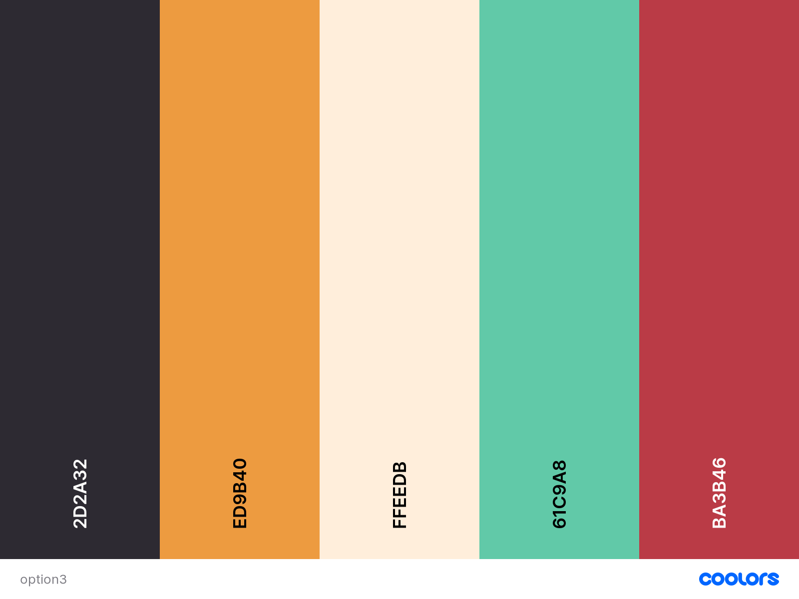
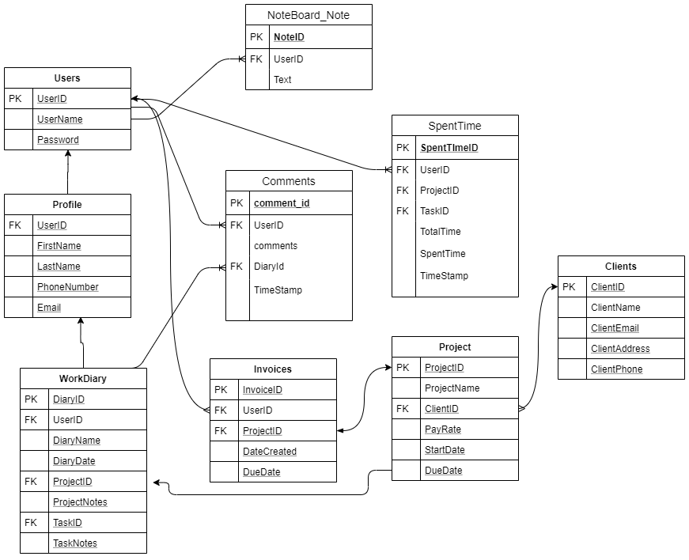

# Work Tracking System _by NoName_    
**Project Folder:** [HTTP5303 - Web Project Google Drive](https://drive.google.com/open?id=1mmVmalxWiqwlrVFrN070fYyj8wlPAneu)  
  
## Learning Stack
- Python + Django
- MySQL
- SASS
- Design tools: Figma / Adobe

# Weekly Task List - Faith McQueen
## Task Lists & Status
#### (Week 1)
- [x] IDE installation (PyCharm), Python, and Django
- [x] Feature wireframes and ERD
- [x] Code "Hello World" in Python

#### (Week 2)
- [x] Begin working on group repository
- [x] Create models for all tables
- [x] Research views and model relationships to create pages

#### (Week 3)
- [x] CRUD functionality for tasks
- [x] Create views/UI for all task CRUD functions on front end

#### (Week 4)
- [x] Begin Sass research, how to use
- [x] Resolve error on task list page (not allowing URL path to be used)

#### (Week 5)
- [x] Connect tasks to project details page for project view of task

#### (Week 6)
- [x] Complete Sass styling
- [x] Resolve bug on project details page showing all tasks without any changes if task marked as complete

#### (Week 7)
- [x] Deploy project
- [] Final Presentation

## [Learning Notes](https://github.com/2020-Summer-HTTP5303-A/project-and-learning-documentations-noname/tree/master/FaithMcQueen/LearningNotes)
- Notes from Python tutorials
- Notes on Sass

## [Code](https://github.com/2020-Summer-HTTP5303-A/project-and-learning-documentations-noname/tree/master/FaithMcQueen/ProjectCode)
- All project code kept here before merging to root folder

## Project Basics  
### Color Palette  
   
### ERD  
 
# PyTrakr
# pytrackr-live
